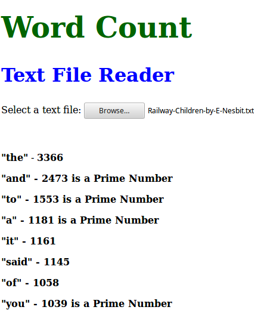

# Wordcount

Given a book in a text file (http://www.loyalbooks.com/download/text/Railway-Children-by-E-Nesbit.txt for example)

1. Write an application that outputs the individual words that appear in the book, and how many times that word appears in the text file.
2. The second part is to also output whether the number of times each word appears is a prime number.
 
The following assumptions can be made:
Ignore punctuation and capitalisation
TDD is expected

### Technologies used
- JavaScript
- Test framework: Jasmine
- Version Control System: GIT

### Installation Running Instructions

1. Clone this repository by typing the following in the command line.
   ```
   git clone git@github.com:AaronRodrigues/wordcount.git
   ```
2. Navigate to the directory. 

### Working Instructions

1. Open index.html in the views folder in a web browser.
2. In the browser, select the text file from the sample-text folder.
3. You can choose any other text file stored on your computer as well.
4. A list of words and their frquency in the text will be displayed.
5. If the word frequency is a Prime Number, it is indicated as shown in the screenshot.



### Running Tests

1. Tests can be run by opening SpecRunner.html in a web browser.


### Approach

1. WordCount object takes string of text as an argument and stores it.
2. Converts a body of text into a an array of lowercase words.
3. WordCount removes duplicate words from array and saves this array as a reference array.
4. Uses this reference array and counts the words in the text.
5. Arrange the words and frequency in decreasing order.
6. Checks if a number is Prime and indicates this in the view.

### Problems Faced

 I found difficulty in reading the text file using JavaScript. I found this easier to do in languages like Ruby. I used a FileReader script which I was not sure how to test.

### Further Improvements

1. Add more styling to index.html
2. Add code coverage and continous integration using Travis-CI

